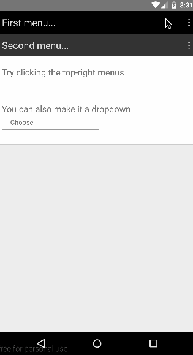

# react-native-menu

A menu component for Android and iOS that provides a dropdown similar to Android's
[Spinner](http://developer.android.com/reference/android/widget/Spinner.html), but does not
retain a persistent selection.

The API is very flexible so you are free to extend the styling and behaviour.

## Installation

```
$ npm install react-native-menu --save
```

## Demo

| iOS | Android |
| --- | ------- |
|  |  |

## Basic Usage

```js
import React, { View, Text, AppRegistry } from 'react-native';
import Menu, { MenuContext, MenuOptions, MenuOption, MenuTrigger } from 'react-native-menu';

const App = () => (
  <MenuContext style={{ flex: 1 }}>
    <TopNavigation/>
    <View style={{ flex: 1, justifyContent: 'center', alignItems: 'center' }}><Text>Hello!</Text></View>
  </MenuContext>
);

const TopNavigation = () => (
  <View style={{ padding: 10, flexDirection: 'row', backgroundColor: 'pink' }}>
    <View style={{ flex: 1 }}><Text>My App</Text></View>
    <Menu onSelect={(value) => alert(`User selected the number ${value}`)}>
      <MenuTrigger>
        <Text style={{ fontSize: 20 }}>&#8942;</Text>
      </MenuTrigger>
      <MenuOptions>
        <MenuOption value={1}>
          <Text>One</Text>
        </MenuOption>
        <MenuOption value={2}>
          <Text>Two</Text>
        </MenuOption>
      </MenuOptions>
    </Menu>
  </View>
);

AppRegistry.registerComponent('Example', () => App);
```

**Important:** In order for the `<Menu/>` to work, you need to mount `<MenuContext/>` as an ancestor to `<Menu/>`. This allows
the menu to open on top of all other components mounted under `<MenuContext/>` -- basically, the menu will be moved
to be the last child of the context.

You must also have a `<MenuTrigger/>` and a `<MenuOptions/>` as direct children under `<Menu/>`. The `MenuTrigger` component
opens the menu when pressed. The `MenuOptions` component can take *any* children, but you need at least one `MenuOption`
child in order for the menu to actually do anything.

The `MenuOption` component can take *any* children.

Please refer to the full working example [here](./Example/Example.js).

## API

### MenuContext

Methods:

- openMenu() -- Opens the menu
- closeMenu() -- Closes the menu
- toggleMenu() -- Toggle the menu between open and close

Props:

*None*

### Menu

Props:

- `onSelect` -- This function is called with the value the `MenuOption` that has been selected by the user

### MenuTrigger

Props:

- `disabled` -- If true, then this trigger is not pressable
- `style` -- Overrides default style properties (user-defined style will take priority)

### MenuOptions

Props:

- `style` -- Overrides default style properties (user-defined style will take priority)

**Note:** The default style for `MenuOptions` is as follows:

```js
{
    position: 'absolute',
    borderRadius: 2,
    overflow: 'hidden',
    backgroundColor: 'white',
    width: 200,

    // Shadow only works on iOS.
    shadowColor: 'rgba(0, 0, 0, .8)',
    shadowOffset: { width: 5, height: 5 },
    shadowRadius: 3,

    // This will elevate the view on Android, causing shadow to be drawn.
    elevation: 5
  }
```

If you want to change the `width`, for example, you will do `<MenuOptions style={{ width: 300 }}>`.

### MenuOption

Props:

- `disabled` -- If true, then this option is not selectable
- `style` -- Overrides default style properties (user-defined style will take priority)


### Changelog

#### 0.18.6

- Dropdown menu now animates in (using scale animation) instead of just appearing.
- Fixed opacity issue with backdrop for iOS
