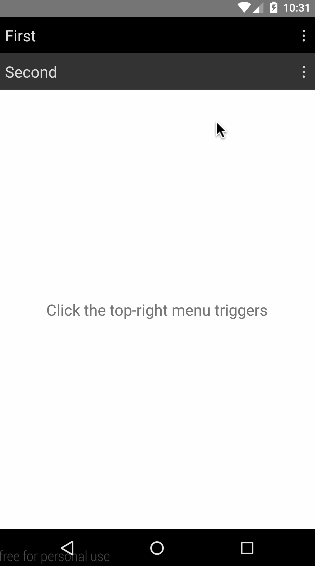

# react-native-menu

A menu component for Android and iOS that provides a dropdown similar to Android's
[Spinner](http://developer.android.com/reference/android/widget/Spinner.html), but does not
retain a persistent selection.

## Installation

```
$ npm install react-native-menu --save
```

## Demo

| iOS | Android |
| --- | ------- |
|  |  |

## Basic Usage

```js
import Menu from 'react-native-menu';
const { MenuContext, MenuOptions, MenuOption, MenuTrigger } = Menu;

// Inside of a component's render() method:
render() {
  return (
    <MenuContext flex={{ flex: 1 }}>
      <Menu>
        <MenuTrigger>
          <Text>open</Text>
        </MenuTrigger>
        <MenuOptions>
          <MenuOption value={1}>
            <Text>One</Text>
          </MenuOption>
          <MenuOption value={2}>
            <Text>Two</Text>
          </MenuOption>
          <MenuOption value={3}>
            <Text>Three</Text>
          </MenuOption>
        </MenuOptions>
      </Menu>
    </MenuContext>
  );
}
```

## Example

**Important:** In order for the `<Menu/>` to work, you need to mount `<MenuContext/>` as an ancestor to `<Menu/>`. This allows
the menu to open on top of all other components mounted under `<MenuContext/>` -- basically, the menu will be moved
to be the last child of the context.

You must also have a `<MenuTrigger/>` and a `<MenuOptions/>` as direct children under `<Menu/>`. The `MenuTrigger` component
opens the menu when pressed. The `MenuOptions` component can take *any* children, but you need at least one `MenuOption`
child in order for the menu to actually do anything.

The `MenuOption` component can take *any* children.

```js
// App.js
render() {
  return (
    <MenuContext>
      <SomeOtherComponent/>
      <YetAnotherComponent/>
    </MenuContext>
  );
}

// SomeOtherComponent.js
render() {
  return (
    <View>
        <Menu onSelect={...}>
        <MenuTrigger>
          <Text>OPEN</Text>
        </MenuTrigger>
        <MenuOptions>
          <MenuOption value={1}>
            <Text>One</Text>
          </MenuOption>
          <MenuOption value={2}>
            <Text>Two</Text>
          </MenuOption>
        </MenuOptions>
      </Menu>
    </View>
  );
}
```

Please refer to the full working example [here](./Example/Example.js).

### Usage (API)

#### MenuContext

Methods:

- openMenu() -- Opens the menu
- closeMenu() -- Closes the menu
- toggleMenu() -- Toggle the menu between open and close

Props:

*None*

#### Menu

Props:

- `onSelect` -- This function is called with the value the `MenuOption` that has been selected by the user
- `style` -- Overrides default style

#### MenuTrigger

Props:

- `disabled` -- If true, then this trigger is not pressable
- `style` -- Overrides default style

#### MenuOptions

Props:

- `style` -- Overrides default style


#### MenuOption

Props:

- `disabled` -- If true, then this option is not selectable
- `style` -- Overrides default style