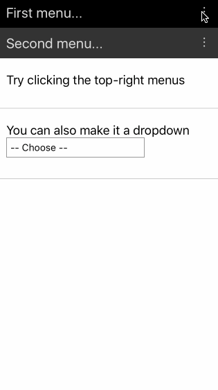

[](https://www.npmjs.com/package/react-native-menu)

# react-native-menu

A menu component for Android and iOS that provides a dropdown similar to Android's
[Spinner](http://developer.android.com/reference/android/widget/Spinner.html), but does not
retain a persistent selection.

The API is very flexible so you are free to extend the styling and behaviour.

## Installation

```
$ npm install react-native-menu --save
```

## Demo

| iOS | Android |
| --- | ------- |
|  |  |

## Basic Usage

```js
import React, { View, Text, AppRegistry } from 'react-native';
import Menu, { MenuContext, MenuOptions, MenuOption, MenuTrigger } from 'react-native-menu';

const App = () => (
  // You need to place a MenuContext somewhere in your application, usually at the root.
  // Menus will open within the context, and only one menu can open at a time per context.
  <MenuContext style={{ flex: 1 }}>
    <TopNavigation/>
    <View style={{ flex: 1, justifyContent: 'center', alignItems: 'center' }}><Text>Hello!</Text></View>
  </MenuContext>
);

const TopNavigation = () => (
  <View style={{ padding: 10, flexDirection: 'row', backgroundColor: 'pink' }}>
    <View style={{ flex: 1 }}><Text>My App</Text></View>
    <Menu onSelect={(value) => alert(`User selected the number ${value}`)}>
      <MenuTrigger>
        <Text style={{ fontSize: 20 }}>&#8942;</Text>
      </MenuTrigger>
      <MenuOptions>
        <MenuOption value={1}>
          <Text>One</Text>
        </MenuOption>
        <MenuOption value={2}>
          <Text>Two</Text>
        </MenuOption>
      </MenuOptions>
    </Menu>
  </View>
);

AppRegistry.registerComponent('Example', () => App);
```

**Important:** In order for the `<Menu/>` to work, you need to mount `<MenuContext/>` as an ancestor to `<Menu/>`. This allows
the menu to open on top of all other components mounted under `<MenuContext/>` -- basically, the menu will be moved
to be the last child of the context.

You must also have a `<MenuTrigger/>` and a `<MenuOptions/>` as direct children under `<Menu/>`. The `MenuTrigger` component
opens the menu when pressed. The `MenuOptions` component can take *any* children, but you need at least one `MenuOption`
child in order for the menu to actually do anything.

The `MenuOption` component can take *any* children.

Please refer to the full working example [here](./Example/Example.js).

## API

### MenuContext

Methods:

- isMenuOpen() -- Returns `true` if menu is open
- openMenu() -- Opens the menu
- closeMenu() -- Closes the menu
- toggleMenu() -- Toggle the menu between open and close

Props:

*None*

### Menu

Methods:

- getName() -- Returns the menu name (e.g. useful to get auto generated name)

Props:

- `onSelect` -- This function is called with the value the `MenuOption` that has been selected by the user

### MenuTrigger

Props:

- `disabled` -- If true, then this trigger is not pressable
- `style` -- Overrides default style properties (user-defined style will take priority)

### MenuOptions

Props:

- `optionsContainerStyle` -- Provides custom styling for options container
- `renderOptionsContainer` -- A function that renders takes in the `MenuOptions` element and renders a container element
  that contains the options. Default function wraps options with a `ScrollView`.

For example, if you want to change the options width to `300`, you can use `<MenuOptions optionsContainerStyle={{ width: 300 }}>`.
To further customize the rendered content you can do something like
`<MenuOptions renderOptionsContainer={(options) => <SomeCustomContainer>{options}</SomeCustomContainer>}>`.

### MenuOption

Props:

- `disabled` -- If true, then this option is not selectable
- `style` -- Overrides default style properties (user-defined style will take priority)

## Latest Changes

### 0.18.15

- Fixes issue where multiple unnamed `Menu` components under one `MenuContext
  causes bad positioning.

### 0.18.14

- Lazily calculate menu position on open -- fixes stale calculation issues.

### 0.18.12

- Fixes regression where multiple menus within a context did not work.

## Roadmap

### Features

- Allow positioning of menu to be customized (currently only anchors to top-right of `Menu`).
- Detect if the menu will be rendered off-screen, and adjust positioning accordingly.

## Testing

Install dev modules:

```
npm install
```

### Run unit tests

```
npm run test:unit
```

### Run integration tests

Make sure you have a connected android device. You find list devices using `adb devices`.

```
npm run test:integration
```

## Contributing

Contributions are welcome! Just open an issues with any ideas or pull-requests.
I will take a look when I have time. :)
